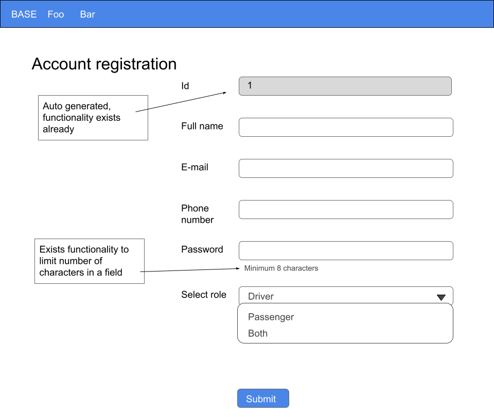
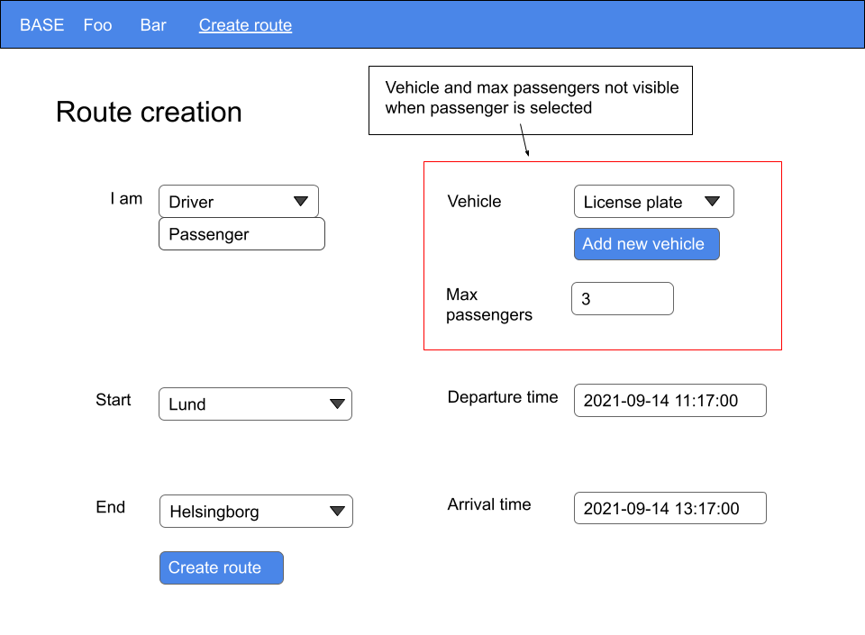
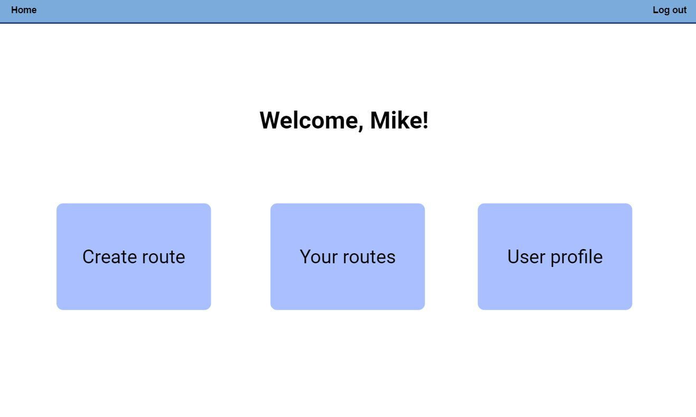
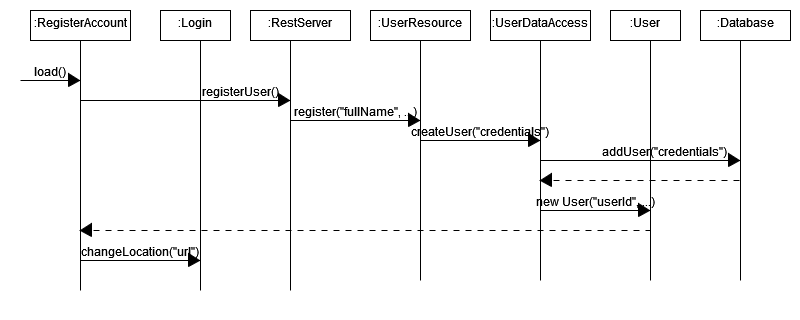
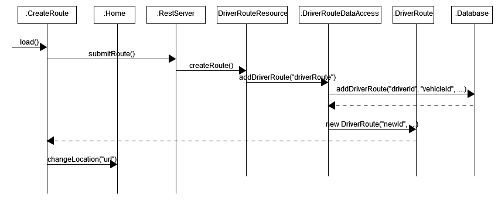
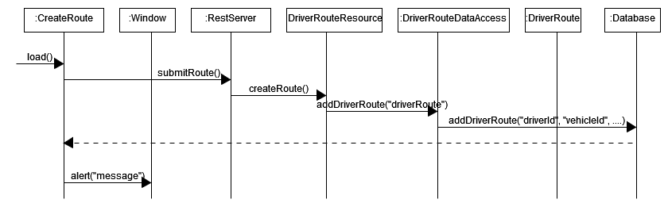
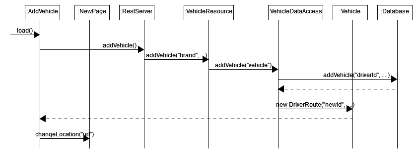
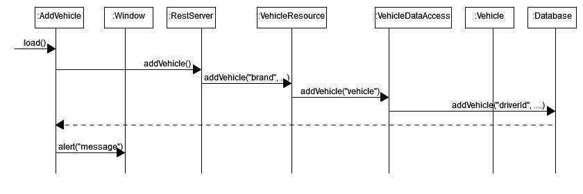
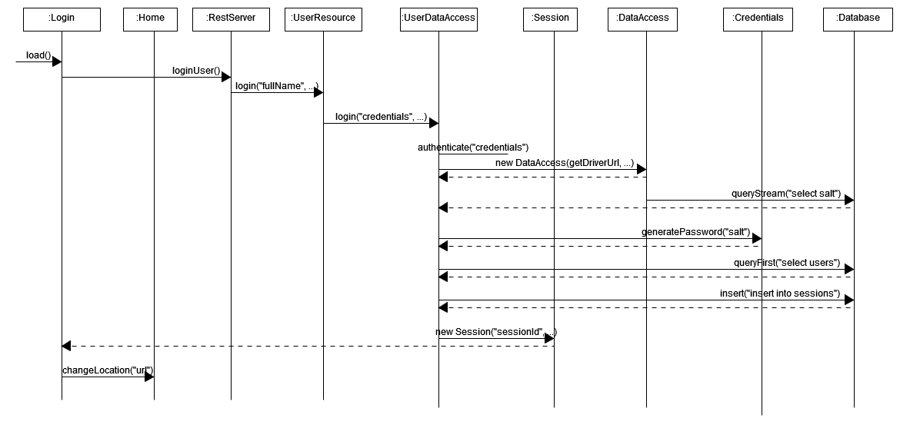
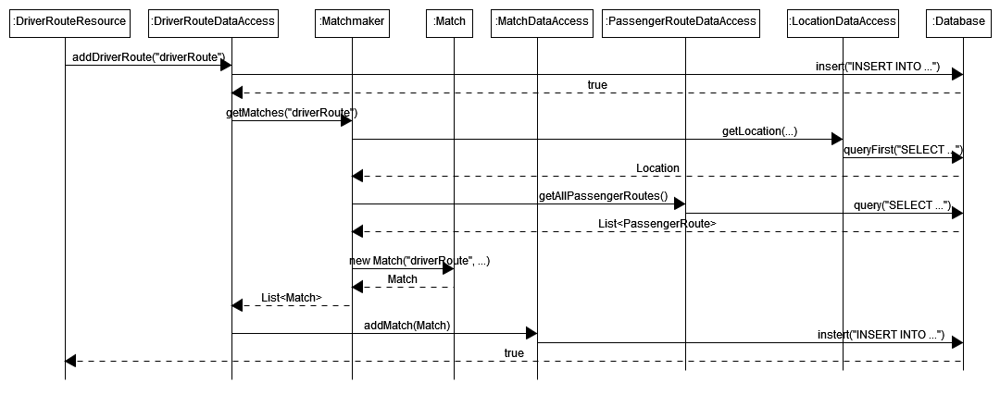

# STLDD - Software Top Level Design Document

If necessary we can move the contents of this to e.g. Overleaf for LaTeX formatting instead of markdown. Mainly in markdown right now so that we can easier keep track of versioning using GitLab, and allow merge requests to this file.

# Contents

- [STLDD - Software Top Level Design Document](#stldd---software-top-level-design-document)
- [Contents](#contents)
- [Document History](#document-history)
- [1. Introduction](#1-introduction)
- [2. Reference documents](#2-reference-documents)
- [3. Overview](#3-overview)
  - [3.1. Back end (Java)](#31-back-end-java)
    - [3.1.1. Resources](#311-resources)
    - [3.1.2. Resource Interfacing](#312-resource-interfacing)
    - [3.1.3. Other](#313-other)
  - [3.2. Front end (HTML / CSS / JavaScript)](#32-front-end-html--css--javascript)
    - [3.2.1. Index](#321-index)
    - [3.2.2. Login](#322-login)
    - [3.2.3. Register](#323-register)
    - [3.2.4. Home page](#324-home-page)
    - [3.2.5. Create route](#325-create-route)
    - [3.2.6. Add vehicle](#326-add-vehicle)
- [4. Class diagram](#4-class-diagram)
  - [4.1. Resources](#41-resources)
    - [4.1.1. User](#411-user)
    - [4.1.2. Vehicle](#412-vehicle)
    - [4.1.3. Routes](#413-routes)
    - [4.1.4. Location](#414-location)
    - [4.1.5. Match](#415-match)
  - [4.2. Other](#42-other)
    - [4.2.1. Matchmaker](#421-matchmaker)
    - [4.2.2. BaseServer](#422-baseserver)
- [5. Database](#5-database)
  - [5.1. users Table](#51-users-table)
  - [5.2. user_roles Table](#52-user_roles-table)
  - [5.3. vehicles Table](#53-vehicles-table)
  - [5.4. locations Table](#54-locations-table)
  - [5.5. driver_routes Table](#55-driver_routes-table)
  - [5.6. passenger_routes Table](#56-passenger_routes-table)
  - [5.7. matches Table](#57-matches-table)
- [6. API routes](#6-api-routes)
  - [6.1. user Routes](#61-user-routes)
  - [6.2. vehicle Routes](#62-vehicle-routes)
  - [6.3. driver-route Routes](#63-driver-route-routes)
  - [6.4. passenger-route Routes](#64-passenger-route-routes)
  - [6.5. match Routes](#65-match-routes)
  - [6.6. location Routes](#66-location-routes)
- [7. Front end designs](#7-front-end-designs)
  - [7.1. Account registration](#71-account-registration)
  - [7.2. Route creation](#72-route-creation)
  - [7.3. Home page](#73-home-page)
- [8. Sequence diagrams](#8-sequence-diagrams)
  - [8.1. Account registration](#81-account-registration)
  - [8.2. Route creation](#82-route-creation)
  - [8.3. Vehicle registration](#83-vehicle-registration)
  - [8.4. Login](#84-login)
  - [8.3. Match](#83-match)

# Document History

| Version | Date | Responsible | Description |
|:-|:-|:-|:-
| 1.0 | 2021-09-12 | SG | Initial draft (intro, backend, and database).
| 1.1 | 2021-09-12 | SG | Add car brand and model to Vehicle class.
| 1.2 | 2021-09-13 | SG | Add frontend top level design.
| 1.3 | 2021-09-15 | UG3 | Update database type `TINYTEXT` -> `VARCHAR`.
| 1.4 | 2021-09-15 | UG3 | Add `password_hash` and salt to `users` table.
| 1.5 | 2021-09-15 | UG3 | Add `user_roles` table and `role` to `users` table.
| 1.6 | 2021-09-15 | UG3 | Update database type `BIGINT` -> `INT`.
| 1.7 | 2021-09-15 | SG | Note that the `locations` table is pre-populated.
| 1.8 | 2021-09-17 | UG3 | Add maximum available seats to `DriverRoute`.
| 1.9 | 2021-09-28 | SG | Add `role` to `User` class instead of `admin`.
| 1.10 | 2021-09-28 | SG | Update list of locations to start/end in `Route` class.
| 1.11 | 2021-09-28 | SG | Add Jetty/Jersey description to `BaseServer`.
| 1.12 | 2021-09-28 | SG | Add `Match`, `Location`, `DataAccess`, and `Resource` classes.
| 1.13 | 2021-09-28 | SG | Categorize classes and improve descriptions.
| 1.14 | 2021-09-28 | SG | Update Contents section.
| 1.15 | 2021-09-28 | SG | Update frontend components.
| 1.16 | 2021-09-28 | SG | Add UML class diagram for the `Vehicle` resource.
| 1.17 | 2021-09-29 | SG | Add frontend designs for Register account, Create route and Home pages.
| 1.18 | 2021-09-29 | SG | Add sequence diagrams.
| 1.19 | 2021-09-29 | SG | Clean up formatting and fix spelling errors.
| 1.20 | 2021-10-01 | UG2 | Updated location specifications with latitude and longitude.
| 1.21 | 2021-10-04 | SG | Add and update class diagrams.
| 1.22 | 2021-10-05 | SG | Add foreign keys to database section.
| 1.23 | 2021-10-05 | SG | Rename `driver` -> `is_driver`, `passenger` -> `is_passenger`.
| 1.24 | 2021-10-05 | SG | Add API routes.
| 1.25 | 2021-10-05 | SG | Add schema paths to database.
| 1.26 | 2021-10-05 | SG | Add section numbering.
| 1.27 | 2021-10-05 | SG | Replace `is_driver` and `is_passenger` with equivalent roles.
| 1.28 | 2021-10-06 | SG | Add sequence diagram for matching.
| 1.29 | 2021-10-06 | SG | Updated sequence diagram for matching.

# 1. Introduction

This document describes the high-level design of a Tomcat web server with a MySQL database. The software consists of a login system and a route planning and matchmaking system. Idea being that users sign up as passengers and/or drivers, request or submit routes they want to take respectively, then get matched with a driver or passengers wanting to take the same route.

# 2. Reference documents

There are no referenced documents yet.

# 3. Overview

## 3.1. Back end (Java)
### 3.1.1. Resources
**class User** Contains ID, full name, phone number, email, and role (DRIVER / PASSENGER / BOTH / ADMIN).

**class Vehicle** Contains ID, owner (`User`), car brand, model, license plate, and color.

**class Route** Contains start and end `Location`s, as well as departure and arrival times.

**class DriverRoute** Extends `Route` and additionally contains the maximum amount of available seats, `Vehicle` and the driver (`User`) that will be driving this route.

**class PassengerRoute** Extends `Route` and additionally contains the passenger (`User`) that wants to take this route.

**class Match** Contains a one-to-one relation of `PassengerRoute` and `DriverRoute`, along with the estimated pick-up and drop-off times.

**class Location** Contains the ID, name, municipality, latitude, longitude, and tolerance.

### 3.1.2. Resource Interfacing
**class {resource}DataAccess** Extends `DataAccess<{resource}>` which enables interfacing with the database for the respective object (User, Vehicle, etc).

**class {resource}Resource** Defines various tags such as `@GET`, `@Path("user")`, and `@PermitAll` which tells Jersey how to handle API requests. When receiving a request matching the route specified by a resource method, it is called. This allows the frontend to interface with the backend through the API.

### 3.1.3. Other
**class Matchmaker** This class is responsible for producing `Match` objects given `PassengerRoute`s and `DriverRoute`s. This should utilize a route finding algorithm to determine which passengers to pick up and in what order. What exact algorithm has not been decided yet.

**class BaseServer** This class starts the Tomcat server using Jetty, with Jersey forming the basis of resource interaction (users, vehicles, routes, etc.) through RESTful API endpoints as defined by the `{object}Resource` classes.

## 3.2. Front end (HTML / CSS / JavaScript)

### 3.2.1. Index
**file index.html** Determines the structure of the navigation header in the webclient.

**file index.css** Determines the style of the navigation header.

**script index.js** Responsible for routing to the correct page when clicking on the tabs in the navigation header and specifies what page is the deafult to load when entering the webpage.

### 3.2.2. Login
**file login.html** Determines the structure of the login page with fields for entering email and password for the account you want to login in to, a button to login and a button to take you to the page were you register a new account in BASE.

**file login.css** Deterimnes the style of the login page.

**script login.js** Responsible for letting the user register and log in. An email and password is entered, sending a POST request to the server to check if correct, with the response being either true or false. Should not distinguish between incorrect email and incorrect password for privacy.

### 3.2.3. Register
**file register.html** Determines the structure of the register page with the fields needed to create a new user in BASE. The fields are Full name, Phone number, Email, Password and Select role. For Select role you can choose to be a driver, passenger or both. 

**file register.css** Determines the style of the Register account page.

**script register.js** Holds the code for the functionality of the register a new account page in BASE. Responsible for sending the new account information to the backend and verifying the account was created succesfully.

### 3.2.4. Home page
**file home-page.html** Determines the structure of the Home-page, the default page when opening BASE. Presents the user with buttons for creating a new route, open the page with created routes and opening the user settings page.

**script home-page.js** Provides code for the functionality of the home-page. Responible for providing the user with the correct page corresponding to the button they press.

### 3.2.5. Create route
**file create-route.html** Determines the structure of the create route page in BASE. Presents the user with the fields required in order to create a new route. Such as start position, end position, date and time and vehicle. 

**file create-route.css** Determines the style of the create route page.

**script create-route.js** Holds code for the functionality of the create route page. Responsible for sending the route information to the backend and verifying the route was created successfully.

### 3.2.6. Add vehicle
**file add-vehicle.html** Determines the structure of the page for adding a new vehicle to your account. Provides the user with the fields Brand, Model, Registration number, Color and Number of seats which are required to add a new vehicle.

**file add-vehicle.css** Determines the style of the page for adding a new vehicle.

**script add-vehicle.js** Holds the code for the functionality of the add new vehicle page and is responible for sending the information to the backend and verifying the new vehicle was added successfully.

# 4. Class diagram

## 4.1. Resources
These figures shows the UML class diagram for how the `{object}`, `{object}DataAccess`, and `{object}Resource` classes relate to each other. Here `{object}Resource` acts as the API endpoint, whose methods interface with the database through `{object}DataAccess`.

### 4.1.1. User

### 4.1.2. Vehicle

### 4.1.3. Routes

### 4.1.4. Location

### 4.1.5. Match

## 4.2. Other

### 4.2.1. Matchmaker

### 4.2.2. BaseServer
Handles incoming HTTP requests using a handler list which includes our resource configuration. This allows the servlet to receive API requests and respond to them according to the receiving `{object}Resource` class. `BaseServer` also performs the first-time setup of the database if that has not already been done.

# 5. Database

| Schema path | Purpose |
|:-|:-
| `etsn05-team1/base/server/src/main/resources/se/lth/base/server/database/schema.sql` | Sets up tables
| `etsn05-team1/base/server/src/main/resources/se/lth/base/server/database/schema_locations.sql` | Adds locations from the market research

## 5.1. users Table
| Field | Type | Null | Key | Default | Extra | Foreign Key |
|:-|:-|:-|:-|:-|:-|:-
| id | INT | no | primary | | auto_increment
| full_name | VARCHAR(120) | no
| email | VARCHAR(320) | no
| phone_number | VARCHAR(45) | no
| role_id | TINYINT | no | | | | user_roles.id
| salt | BIGINT | no
| password_hash | UUID | no

## 5.2. user_roles Table
| Field | Type | Null | Key | Default | Extra | Foreign Key |
|:-|:-|:-|:-|:-|:-|:-
| id | INT | no | primary
| name | VARCHAR(10) | no

Where (1, 'ADMIN'), (2, 'BOTH'), (3, 'DRIVER'), (4, 'PASSENGER') is inserted.

## 5.3. vehicles Table
| Field | Type | Null | Key | Default | Extra | Foreign Key |
|:-|:-|:-|:-|:-|:-|:-
| id | INT | no | primary | | auto_increment
| driver_id | INT | no | | | | users.id
| license plate | VARCHAR(12) | no
| brand | VARCHAR(32) | yes | | NULL
| color | VARCHAR(32) | yes | | NULL
| model | VARCHAR(32) | yes | | NULL

## 5.4. locations Table
| Field | Type | Null | Key | Default | Extra | Foreign Key |
|:-|:-|:-|:-|:-|:-|:-
| id | INT | no | primary | | auto_increment
| name | TINYTEXT | no
| latitude | DECIMAL | no
| longitude | DECIMAL | no

These are the pre-populated locations available to choose from, and will appear in the dropdowns.

## 5.5. driver_routes Table
| Field | Type | Null | Key | Default | Extra | Foreign Key |
|:-|:-|:-|:-|:-|:-|:-
| id | INT | no | primary | | auto_increment
| driver_id | INT | no | | | | users.id
| vehicle_id | INT | no | | | | vehicles.id
| max_available_seats | TINYINT | no
| start_location_id | INT | no | | | | locations.id
| end_location_id | INT | no | | | | locations.id
| depart_at | TIMESTAMP | no
| arrive_at | TIMESTAMP | no

## 5.6. passenger_routes Table
| Field | Type | Null | Key | Default | Extra | Foreign Key |
|:-|:-|:-|:-|:-|:-|:-
| id | INT | no | primary | | auto_increment
| passenger_id | INT | no | | | | users.id
| start_location_id | INT | no | | | | locations.id
| end_location_id | INT | no | | | | locations.id
| desired_depart_at | TIMESTAMP | yes | | NULL
| desired_arrive_at | TIMESTAMP | no

## 5.7. matches Table
| Field | Type | Null | Key | Default | Extra | Foreign Key |
|:-|:-|:-|:-|:-|:-|:-
| driver_route_id | INT | no | primary | | | driver_routes.id
| passenger_route_id | INT | no | primary | | | passenger_routes.id
| passenger_depart_at | TIMESTAMP | no
| passenger_arrive_at | TIMESTAMP | no

Where `passenger_depart/arrive_at` is the actual time, as opposed to the `desired_depart/arrive_at` in the `passenger_routes` table.

# 6. API routes

## 6.1. user Routes

| Method | Route | Data | Returns |
|:-|:-|:-|:-
| GET | /rest/user | | The current user
| GET | /rest/user/{id} | | The user with the given ID
| GET | /rest/user/all | | A list of all users
| GET | /rest/user/roles | | A set of all possible user roles
| POST | /rest/user/login | email, password | Whether the login attempt was successful
| POST | /rest/user/logout | | Whether the logout attempt was successful
| POST | /rest/user | email, password | The created user
| PUT | /rest/user/{id} | email, password, full_name, ... | The updated user
| DELETE | /rest/user/{id} | | Whether the user was successfully deleted

## 6.2. vehicle Routes

| Method | Route | Data | Returns |
|:-|:-|:-|:-
| GET | /rest/vehicle/{id} | | The vehicle with the given ID
| GET | /rest/vehicle/user-vehicles | | A list of all vehicles owned by the current user
| POST | /rest/vehicle | license_plate, brand, color, model | The created vehicle
| DELETE | /rest/vehicle/{id} | | Whether the vehicle was successfully deleted

## 6.3. driver-route Routes

| Method | Route | Data | Returns |
|:-|:-|:-|:-
| GET | /rest/driver-route/all | | A list of all driver routes
| GET | /rest/driver-route/user-routes | | A list of driver routes created by the current user
| POST | /rest/driver-route | vehicle_id, start_location_id, ... | The created driver route
| DELETE | /rest/driver-route/{id} | | Whether the driver route was successfully deleted

## 6.4. passenger-route Routes

| Method | Route | Data | Returns |
|:-|:-|:-|:-
| GET | /rest/passenger-route/all | | A list of all passenger routes
| GET | /rest/passenger-route/user-routes | | A list of passenger routes created by the current user
| POST | /rest/passenger-route | vehicle_id, start_location_id, ... | The created passenger route
| DELETE | /rest/passenger-route/{id} | | Whether the passenger route was successfully deleted

## 6.5. match Routes

| Method | Route | Data | Returns |
|:-|:-|:-|:-
| GET | /rest/match/all | | A list of all matches
| GET | /rest/match/driver-route/{id} | | A list of matches encompassing the driver route with this ID, if any
| GET | /rest/match/passenger-route/{id} | | The match encompassing the passenger route with this ID, if any
| POST | /rest/match | driver_route_id, passenger_route_id, arrive_at, depart_at | The created match
| DELETE | /rest/match/{driver-route-id}/{passenger-route-id} | | Whether the match was successfully deleted

## 6.6. location Routes

| Method | Route | Data | Returns |
|:-|:-|:-|:-
| GET | /rest/location/{id} | | The location with the given ID
| GET | /rest/location/all | | A list of all locations
| POST | /rest/location | name, latitude, longitude | The created location

# 7. Front end designs

Below are the page designs of the layout and look of the Register account page, the Create route page and the Home page in BASE.

## 7.1. Account registration

## 7.2. Route creation

## 7.3. Home page

# 8. Sequence diagrams

## 8.1. Account registration
Sequene diagram that shows shows the handling of a successful registration of a new account.

Sequence diagram that shows the handling of an attempt to register with a username that already exists in the databse.

## 8.2. Route creation
Sequence diagram that shows the handling of a successful route creation.

Sequence diagram of the handling of an unsuccessful route creation.

## 8.3. Vehicle registration
Sequence diagram that shows the handling of successfully adding a new vehicle to your account.

Sequence diagram that shows the handling of failure when trying to add a new vehicle.

## 8.4. Login
Sequence diagram that shows the handling of a successful login attempt.

## 8.3. Match
Sequence diagram that shows the handling of matching the drivers route with the passengers routes after a driver route has been added to the databse.

